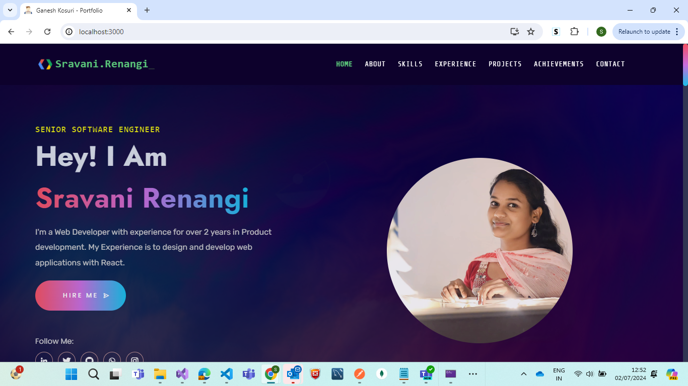

# Developer Portfolio

https://ganesh-kosuri.vercel.app/

<p align="center">

</p>

<br />

## Table of Contents :

- [Sections](#sections-bookmark)
- [Demo](#demo-movie_camera)
- [Installation](#installation-arrow_down)
- [Getting Started](#getting-started-dart)
- [Folder Structure](#folder-structure-open_file_folder)
- [Usage](#usage-joystick)
- [Hosting](#hosting-globe_with_meridians)
- [Packages Used](#packages-used-package)
- [Fonts and Images](#fonts-and-images-performing_arts)
- [Upcoming Features](#upcoming-features-construction)

<br /><br />

# Sections :

- HOME
- ABOUT
- SKILLS
- EXPERIENCE
- MY WORK
- Achievements
- CONTACT ME

<br /><br />

# Demo :

<!-- TODO: need to add gif here -->


## View live demo [here](https://ganesh-kosuri.vercel.app/).

<br />

# Installation :

### You will need to download Git and Node to run this project

- [Git](https://git-scm.com/downloads)
- [Node](https://nodejs.org/en/download/)

## Also check [this](https://reactjs.org/docs/create-a-new-react-app.html) out if you are new to react.

#### Make sure you have the latest version of both Git and Node on your computer.

```
node --version
git --version
```

<br />

### Fork and Clone the repo

#### To Fork the repo click on the fork button at the top right of the page. Once the repo is forked open your terminal and perform the following commands

```
git clone https://github.com/GaneshKosuri/portfolio.git
cd developer-portfolio
```

### Install packages from the root directory

```
npm install
```

### Start the development server

```
npm start
```

<br />

# Folder Structure:

```bash
├── README.md
├── package-lock.json
├── package.json
├── public
│   ├── _redirects
│   ├── favicon.ico
│   ├── favicon.png
│   ├── favicon512.png
│   ├── index.html
│   ├── manifest.json
│   └── robots.txt
├── src
│   ├── index.css
│   ├── index.js
│   ├── App.css
│   ├── App.js
│   ├── components
│   │   ├── AboutMe
│   │   │   ├── AboutMe.css
│   │   │   └── AboutMe.js
│   │   ├── Achievements
│   │   │   ├── Achievements.css
│   │   │   └── Achievements.js
│   │   │   └── AchievementCard.js
│   │   ├── CantactMe
│   │   │   ├── CantactMe.css
│   │   │   └── CantactMe.js
│   │   ├── Experience
│   │   │   ├── Experience.css
│   │   │   ├── Experience.js
│   │   ├── Footer
│   │   │   ├── Footer.css
│   │   │   └── Footer.js
│   │   ├── Home
│   │   │   ├── Home.css
│   │   │   ├── Home.js
│   │   ├── MyWork
│   │   │   ├── MyWork.css
│   │   │   ├── MyWork.js
│   │   ├── Footer
│   │   │   ├── Footer.css
│   │   │   └── Footer.js
│   │   ├── Navbar
│   │   │   ├── Navbar.css
│   │   │   └── Navbar.js
│   │   ├── SkillBars
│   │   │   ├── SkillBars.css
│   │   │   ├── SkillBars.js
│   ├── data
│   │   ├── aboutMe.js
│   │   ├── achievements.js
│   │   ├── contacts.js
│   │   ├── experience.js
│   │   ├── home.js
│   │   ├── links.js
│   │   ├── projects.js
│   │   ├── skills.js
│   ├── images
│   │   ├── Projects
│   │   │   ├── project images
│   │   ├── logos
│   │   │   └── All Logos
```

<br />

# Hosting :globe_with_meridians:

## Vercel

|             Site              |                                                              Docs                                                              |                          Demo                          |
| :---------------------------: | :----------------------------------------------------------------------------------------------------------------------------: | :----------------------------------------------------: |
| [Vercel](https://vercel.com/) | [how to deploy React apps to Vercel](https://medium.com/technology-hits/hosting-your-react-application-on-vercel-f6646c76dc51) | [Youtube](https://www.youtube.com/watch?v=lAJ6LyvW_cw) |

<br />

# Packages Used :package:

|       Client Side Packages        |
| :-------------------------------: |
|             Bootstrap             |
|        @material-ui/icons         |
|               axios               |
|           react-helmet            |
|            react-icons            |
|         react-router-dom          |
|      react-router-hash-link       |
|            react-slick            |
| react-vertical-timeline-component |
|        react-owl-carousel         |
|              emailjs              |
|       react-loader-spinner        |
|          react-toastify           |

<br />

# Fonts and Images :

## Illustrations

- [Icons8](https://icons8.com/illustrations/styles)

## Fonts

- [Poppins](https://fonts.google.com/specimen/Poppins)
- [Montserrat](https://fonts.google.com/specimen/Montserrat)
- [Raleway](https://fonts.google.com/specimen/Raleway)
- [Big Shoulders Text](https://fonts.google.com/specimen/Big+Shoulders+Text)
- [Bestermind](https://www.dafont.com/bestermind.font)
- [Roboto](https://fonts.google.com/specimen/Roboto)

<br />

# Upcoming Features :

- Light/Dark theme toggle
- Services and Blogs section
- More fonts to choose from

<br /><br />
